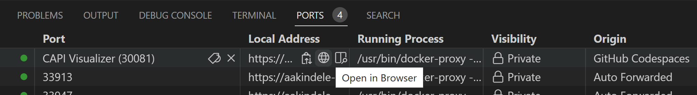

# capi-in-codespaces overview

This repository leverages GitHub Codespaces to setup a Cluster API management cluster using [kind](https://kind.sigs.k8s.io/), allowing the user to provision other kubernetes workload clusters using the `Docker` and `Azure` infrastructure providers.

The goal of this repository is to provide an environment that accelerates a user's ability to start using Cluster API for managing AKS clusters.   The repository contains guided hands-on learning scenarios to familiarize users with Cluster API. The different scenarios include optional challenges to help you further explore the capabilities of Cluster API and AKS.


## Open in Codespace

- Click the Code button
- Click the Codespaces tab
- Click the "Create codespace on main" button


> **Note**
> If you're using an Azure Subscription with [conditional access policies](https://learn.microsoft.com/en-us/azure/active-directory/conditional-access/overview) that require Azure Active Directory access from a managed device, then connect to the newly created Codespace with VS Code Desktop running on a managed device.


## Prerequisites

The main README can be completed with only access to GitHub Codespaces. To continue on with the AKS documentation linked at the bottom of the page, you'll need access to an Azure Subscription with permissions to create a Service Principal.

## What is Cluster API?

Cluster API is a Kubernetes sub-project focused on providing declarative APIs and tooling to simplify provisioning, upgrading, and operating multiple Kubernetes clusters.

One benefit of Cluster API is a common interface for managing Kubernetes clusters across different infrastructure providers like Azure, AWS, GCP, and more.

A diagram showing the different components can be found [here](https://cluster-api.sigs.k8s.io/user/concepts.html).

[Additional Cluster API documentation](https://cluster-api.sigs.k8s.io/)

### Cluster API controllers

> Cluster API has a number of controllers, both in the core Cluster API and the reference providers, which move the state of the cluster toward some defined desired state through the process of controller reconciliation.

Each controller has a set of responsibilities when managing a cluster. For example, the [Cluster controller](https://cluster-api.sigs.k8s.io/developer/architecture/controllers/cluster.html) is responsible for populating common fields on the cluster CRD like the cluster status and API server endpoint. Cluster API is able to retrieve information about clusters through references to provider specific CRDs. These providers and their CRDs also have similar controllers that are responsible for managing the actual state of the cluster infrastructure.

A list of the controllers can be found [here](https://cluster-api.sigs.k8s.io/developer/architecture/controllers.html) with details on the control loop of each controller.

### Cluster API providers

[Providers](https://cluster-api.sigs.k8s.io/reference/glossary.html#provider) are responsible for the different aspects of cluster provisioning, each with specific technology or cloud implementations. For example, the Azure infrastructure provider can create virtual machines, Kubeadm control plane provider can initialize the Kubernetes control plane on the VMs, and the Kubeadm bootstrap provider can transform remaining VMs into Kubernetes nodes and join them to the cluster.

A list of Cluster API providers can be found [here](https://cluster-api.sigs.k8s.io/reference/providers.html).

Details on the Cluster API contract that providers need to follow can be found [here](https://cluster-api.sigs.k8s.io/developer/providers/contracts.html).

### Cluster API CRDs

Kubernetes clusters are described in cluster API as a combination of general Cluster API CRDs and provider specific CRDs. These CRDs represent the different parts of a Kubernetes cluster. For example, the cluster at a high level, the control plane, nodes, node pools, bootstrap configuration, etc.

A diagram of the CRDs and their relationships can be found [here](https://cluster-api.sigs.k8s.io/developer/crd-relationships.html).

For AKS, details of the Azure provider CRDs can be found [here](https://capz.sigs.k8s.io/topics/managedcluster.html#specification).

## Labs

| Lab  | Title | Description |
| ------------- | ------------- | -------- |
| Lab 1 | CAPI with kind | Provision a kind cluster using CAPI and the ??? provider|
| Lab 2 | CAPI with AKS  | Provision AKS Cluster using CAPI and the Azure Provider |
| Lab 3 | CAPI with AKS  | Add a node pool to an AKS Cluster using CAPI and the Azure Provider |

### Cluster API Visualizer

[Cluster API Visualizer](https://github.com/Jont828/cluster-api-visualizer#readme) provides a UI for visualizing the state of Cluster API in the management cluster.

```bash

# Add visualizer app to management cluster
make capi-visualizer

```

In the "PORTS" tab, click the "Open in Browser" button for the visualizer app.



## kind

Cluster API requires an existing Kubernetes cluster accessible via kubectl. During the installation process the Kubernetes cluster will be transformed into a management cluster by installing the Cluster API provider components, so it is recommended to keep it separated from any application workload.

- A management cluster is created and initialized with CAPI/CAPD components as part of the Codespaces setup:

  ```bash

  kubectl get pods -A

  ```

- The `clusterctl` CLI tool handles the lifecycle of a Cluster API management cluster. Ensure an up-to-date version of the CLI installed to your GH Codespaces:

  ```bash

  clusterctl version

  ```

- A workload cluster configuraton with 1 control plane and 1 worker machine is generated as part of the Codespaces setup. It creates a YAML file named `capi-quickstart.yaml` with a predefined list of Cluster API objects; Cluster, Machines, Machine Deployments, etc.

  > When kind management cluster is reset to initial state, transform the kubernetes cluster in to management cluster by running:
  >
  > ```bash
  >
  > export CLUSTER_TOPOLOGY=true
  > clusterctl init --infrastructure docker
  >
  > ```
  >
  > If needed, regenerate the cluster configuration by running:
  >
  > ```bash
  >
  > clusterctl generate cluster capi-quickstart --flavor development \
  > --kubernetes-version v1.26.0 \
  > --control-plane-machine-count=1 \
  > --worker-machine-count=1 \
  > > capi-quickstart.yaml
  >
  > ```

- Open the file to review the contents.

  ```bash

  code capi-quickstart.yaml

  ```

- When ready, run the following command to apply the cluster manifest.

  ```bash

  kubectl apply -f capi-quickstart.yaml

  ```

- Refresh the browser tab for the Visualizer app to view the latest changes.

- Access the workload cluster:

  ```bash

  # validate the workload cluster
  kubectl get cluster

  # validate cluster and its resources
  clusterctl describe cluster capi-quickstart

  # verify the control plane is up
  # INITIALIZED column should be true
  kubectl get kubeadmcontrolplane

  ```

- After the control plane node is up and running, we can retrieve the workload cluster Kubeconfig:

  ```bash

  clusterctl get kubeconfig capi-quickstart > capi-quickstart.kubeconfig

  # update KUBECONFIG so kubectl can access the different config files.
  # useful for easily switching kube contexts
  export KUBECONFIG=~/.kube/config:/workspaces/capi-in-codespaces/capi-quickstart.kubeconfig

  kubectl config rename-context capi-quickstart-admin@capi-quickstart capi-quickstart

  # verify kubectl has access to the new context
  kubectl config get-contexts

  ```

- The control plane won’t be `Ready` until we install a CNI, deploy a CNI solution by running:

   ```bash

   kubectl --context=capi-quickstart \
   apply -f https://raw.githubusercontent.com/projectcalico/calico/v3.24.1/manifests/calico.yaml

   ```

  After a short while, nodes should be running and in `Ready` state, check the status of workload cluster by running:

  ```bash

  kubectl --context=capi-quickstart get nodes

  ```

> NOTE: For experimental and educational purpose, follow [this quickstart](https://cluster-api.sigs.k8s.io/user/quick-start.html) for the manual setup of CAPI and workload clusters

## Next

Continue on with [AKS scenarios](./docs/1-managed-aks-cluster.md). These labs will walk you through different aspects of managing AKS clusters with Cluster API and the Azure provider. These require access to an Azure Subscription and permissions to create a Service Principal.
